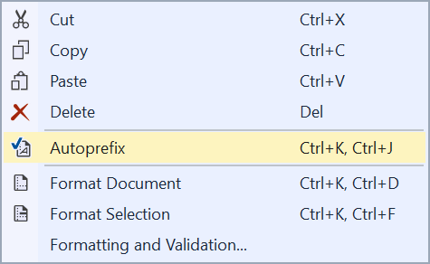

# CSS AutoPrefixer

[](https://ci.appveyor.com/project/madskristensen/javascriptprettier)

<!-- Update the VS Gallery link after you upload the VSIX-->
Download this extension from the [Marketplace](https://visualstudiogallery.msdn.microsoft.com/[GuidFromGallery])
or get the [CI build](http://vsixgallery.com/extension/J1da7ad9e-85b3-4a0c-8e45-b2ae59a575a7/).

---------------------------------------

Prettier is an opinionated JavaScript formatter inspired by refmt with advanced support for language features from ES2017, JSX, and Flow. It removes all original styling and ensures that all outputted JavaScript conforms to a consistent style.

See the [change log](CHANGELOG.md) for changes and road map.

## Features

- Auto-prefixes CSS properties
- Uses [autoprefixer](https://github.com/postcss/autoprefixer) node module

### Prettify
This extension calls the [autoprefixer](https://github.com/postcss/autoprefixer) node module behind the scenes to add missing vendor prefixes to any CSS document.

For example, take the following code:

```css
:fullscreen a {
    display: flex
}
```

Running auto-prefixing makes sure that all vendor specific syntaxes are added.

```css
:-webkit-full-screen a {
    display: -webkit-box;
    display: flex
}
:-moz-full-screen a {
    display: flex
}
:-ms-fullscreen a {
    display: -ms-flexbox;
    display: flex
}
:fullscreen a {
    display: -webkit-box;
    display: -ms-flexbox;
    display: flex
}
```

Invoke the command from the context menu in the CSS editor.



## Contribute
Check out the [contribution guidelines](.github/CONTRIBUTING.md)
if you want to contribute to this project.

For cloning and building this project yourself, make sure
to install the
[Extensibility Tools 2015](https://visualstudiogallery.msdn.microsoft.com/ab39a092-1343-46e2-b0f1-6a3f91155aa6)
extension for Visual Studio which enables some features
used by this project.

## License
[Apache 2.0](LICENSE)